# 实变函数

留言板

开始填坑

这篇文档是针对理学院数学基地班的实变函数课程，教材是侯友亮、王茂发编著的黄色的那本。

就到目前学这门课，确实是很难学。主要是非常的抽象，除了概念题，几乎所有题目都是证明题，很少有计算题。

根据上课期间两次测试感觉，考试的重点应该是基础概念。

预测考试题型是5\-10道选择题，5\-10道填空题，5\-10道判断题、5\-10道概念题、4 5道大题。

## 复习资料

### 第一节复习课的内容：

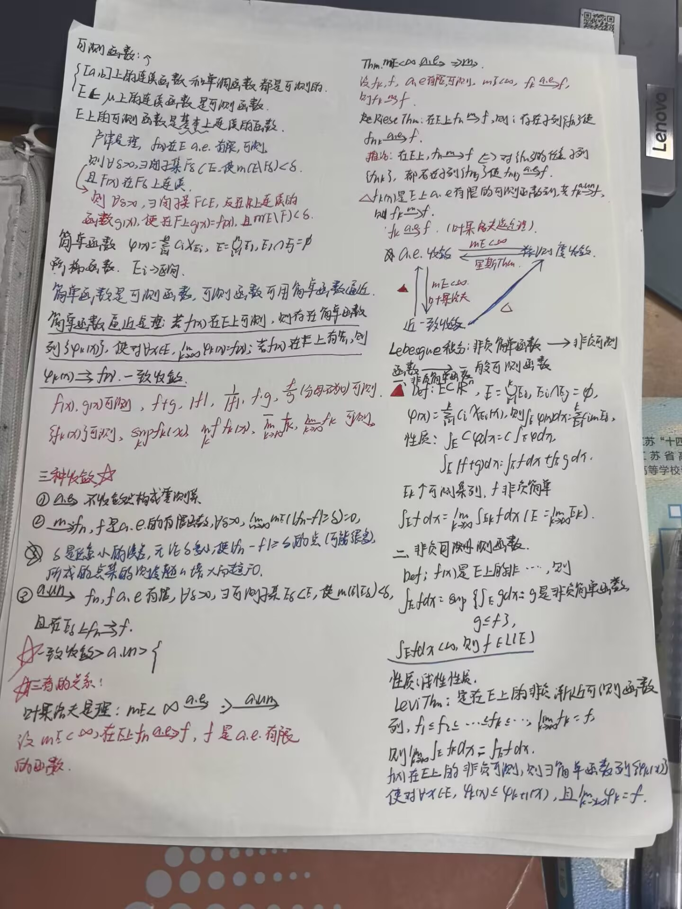

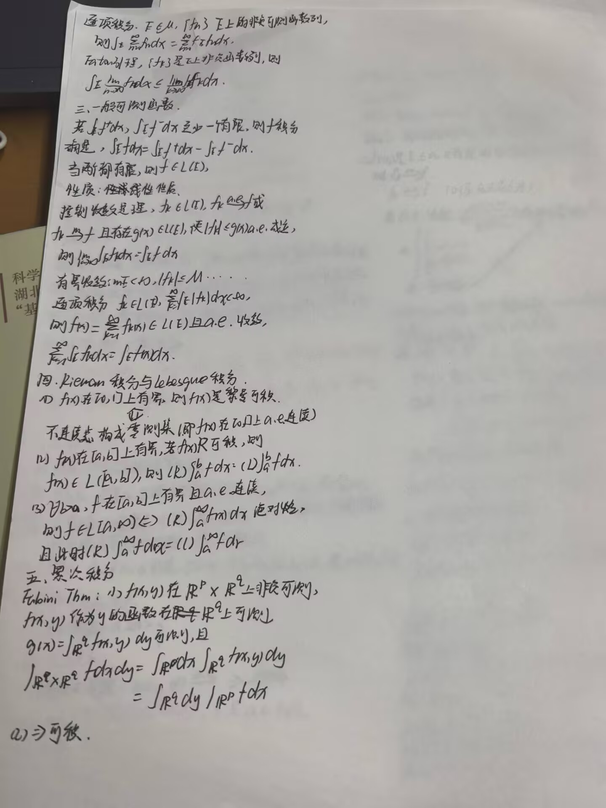

### 第二节复习课的内容：

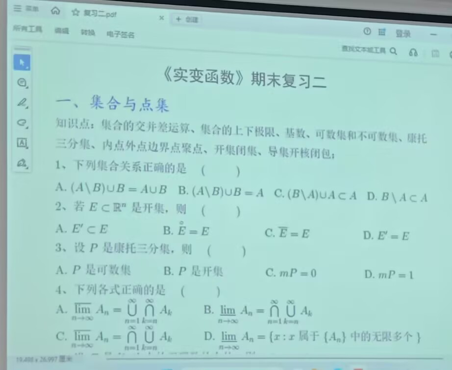

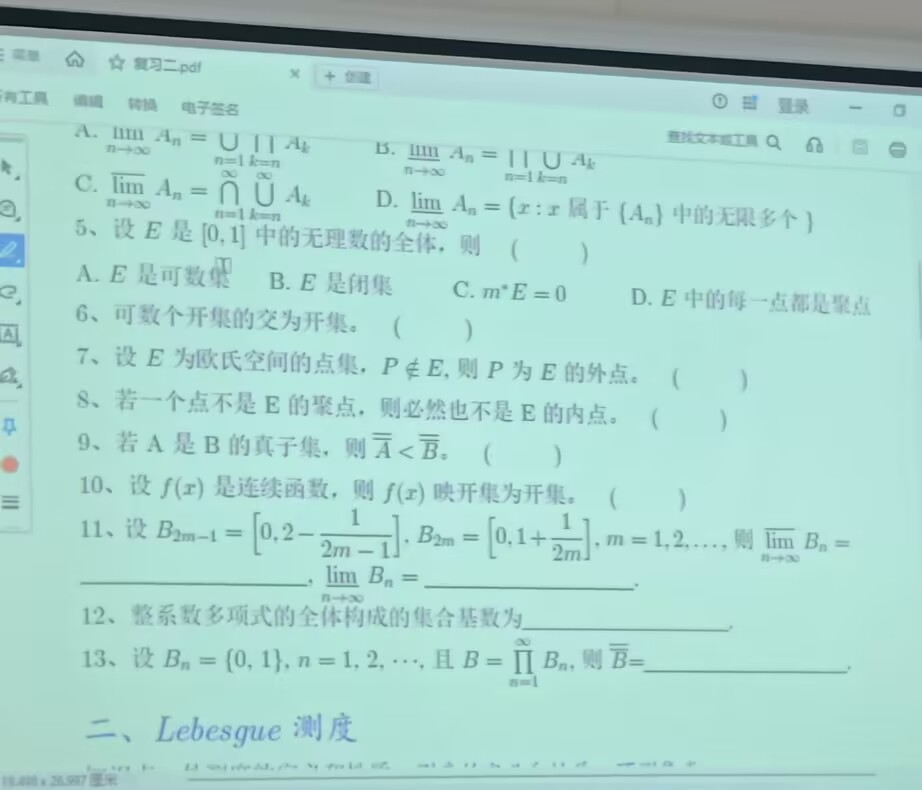

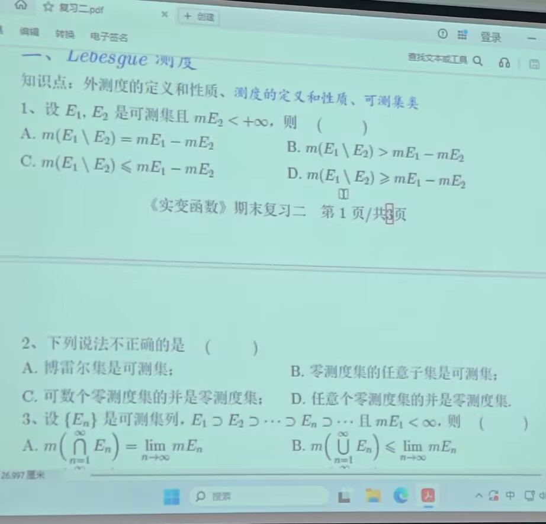

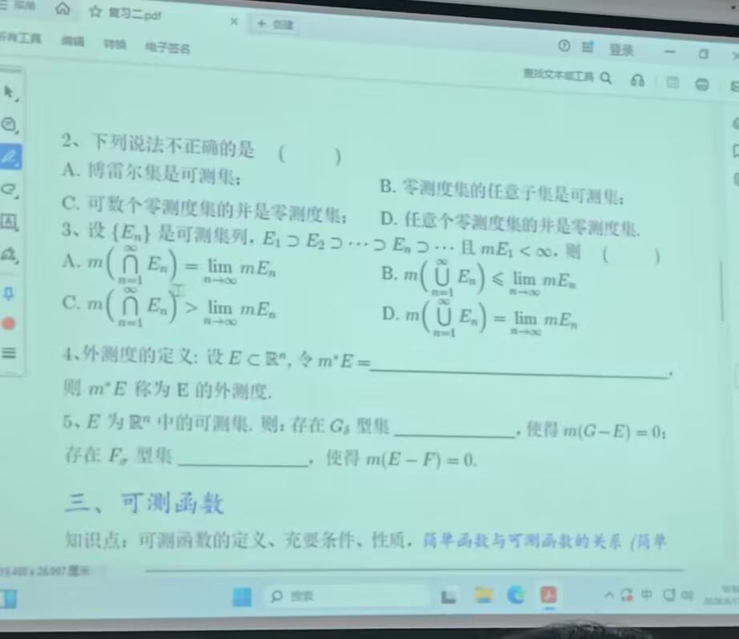

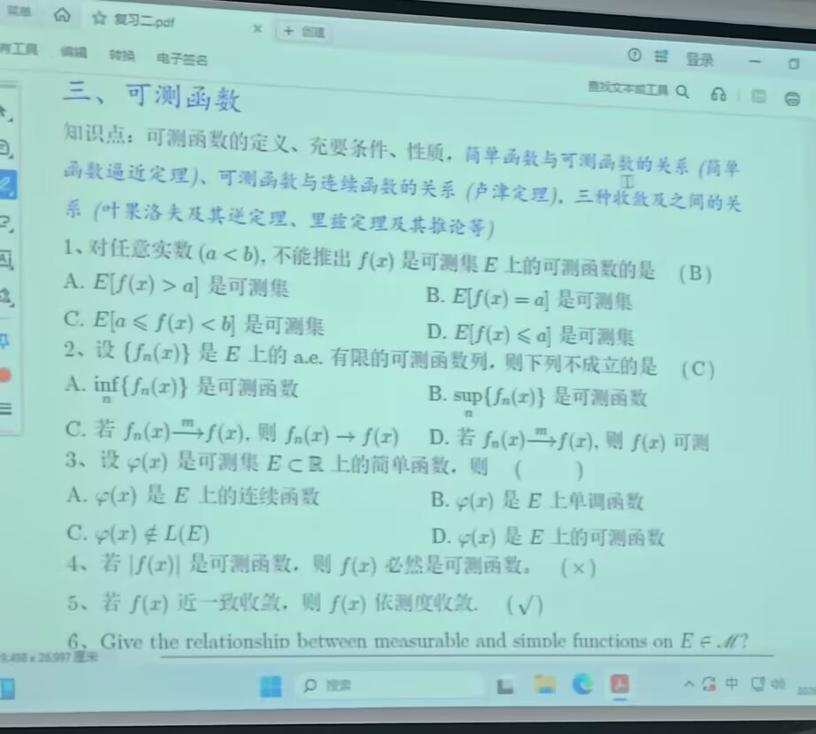

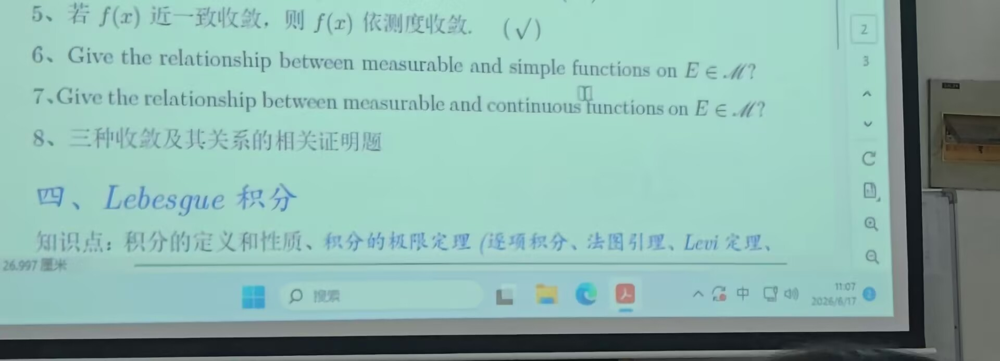

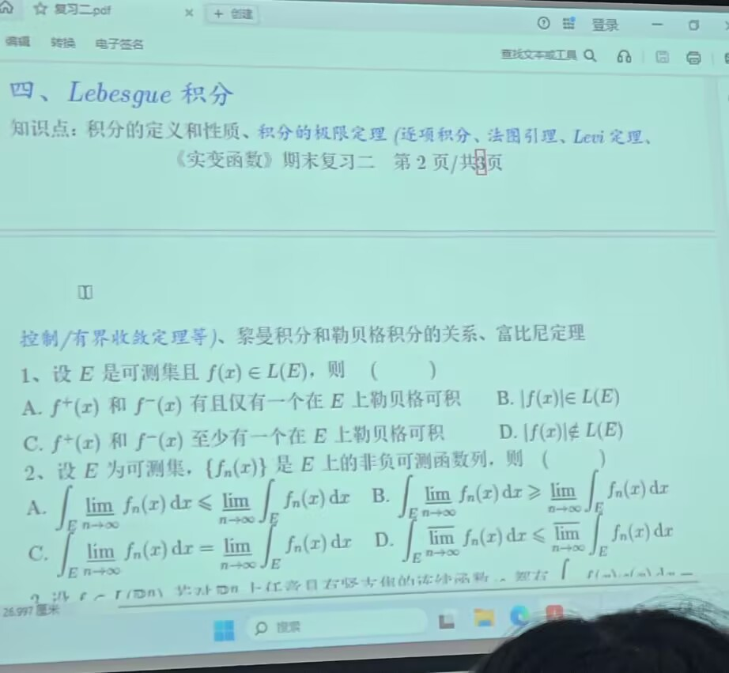

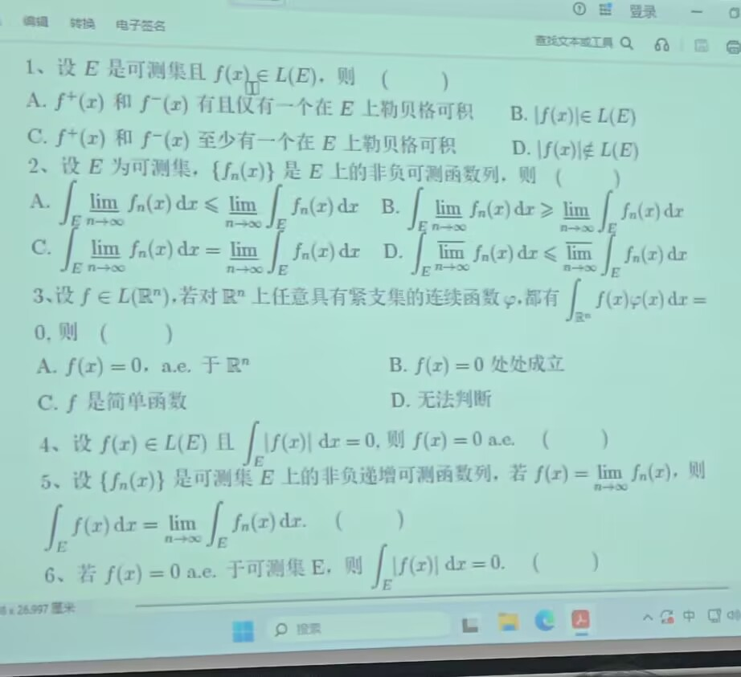

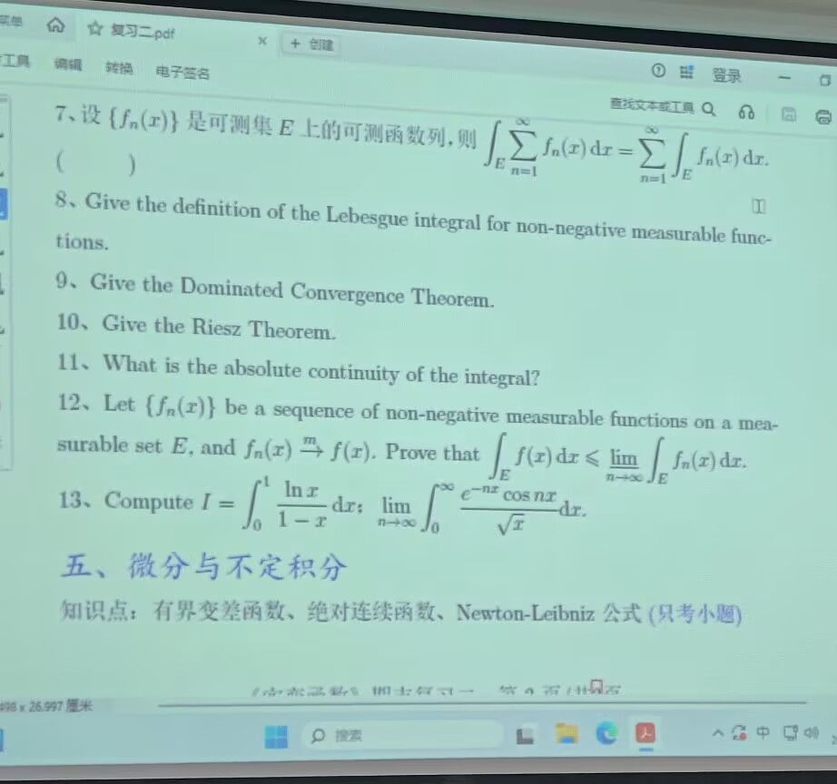

#### **答案：**

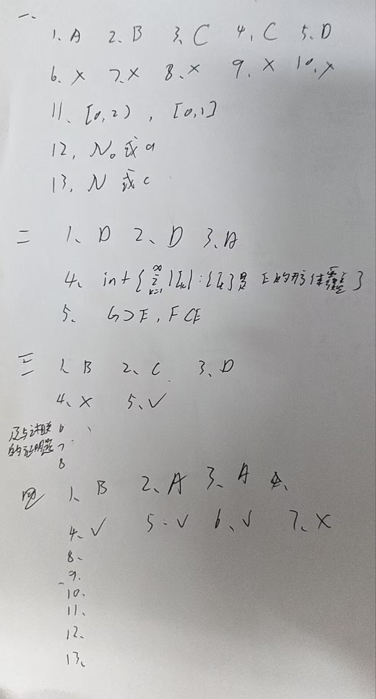

## 往年考题

暂无

## 基础概念

由于实变函数的基础概念实在是太多了，这里只给出重点部分。

### 第一章：集合与点集

***集合的交并差补运算：不多赘述***

**集合的上下极限：**

设 $\{ A_n\}$是个集列

$\varlimsup_{n\to\infty}{A_n} \overset{def}  {=} \bigcap^{\infty}_{n=1} \bigcup ^{\infty}_{k=n}A_k$

$\varliminf_{n\to\infty} A_n\overset{def}{=} \bigcup^{\infty}_{n=1} \bigcap^{\infty}_{k=n}A_k$

或：

$\varlimsup_{n\to \infty} A_n = \{ x: x属于\{ A_n\}中的无限多个\} （频繁出现的元素）$

$\varliminf_{n \to \infty} A_n = \{x:x至多不属于\{A_n\}中的有限多个\}（最终出现的元素）$

**对等：**

设A，B是两个非空集，若存在一个从A到B的双射，则称A与B是对等的，记为 $A \backsim B$,此外补充定义 $\phi \backsim \phi$

**基数：**

设A和B是两个集，如果A\~B，则称A和B具有相同的基数，集A的基数记为 $\overset{=}{A}$。

自然数集N的基数用符号 $\aleph_0$\(读作“阿列夫零”\)表示，也可以用字母 $a$表示。

实数集 $R^1$的基数用符号 $\aleph$表示，也可以用字母 $c$表示。

**定义：**设A和B是两个集，若A与B的一个子集对等，则称A的基数小于或等于B的基数，记为 $\overset{=}{A} \le \overset{=}{B}$\.若A与B的一个真子集对等但与B本身不对等，则称A的基数小于B的基数，记为 $\overset{=}{A}< \overset{=}{B}$

**定理：**若A是无限集，则 $\aleph_0  \le \overset{=}{A}$,即可列集的基数是无限集基数中的最小的一个

**定理：**若A是无限集，B是有限或可列集，则 $\overline{\overline{A \bigcup B}}= \overline{\overline{A}}$

**定理：**设A，B是两个集，若A与B的一个子集对等，且B与A的一个子集对等，则A与B对等，用基数表示就是：若 $\overline{\overline{A}} \le \overline{\overline{B}}$且 $\overline{\overline{B}} \le \overline{\overline{A}}$则 $\overline{\overline{A}} = \overline{\overline{B}}$

**可数集\(countable set\)/可列集\(denumerable set/countable infinite set\)**

**注：**有限集与可列集统称为可数集。

可列集一定是无限的，能排成无穷序列的：可数集=可列集\+有限集。

**可列集：与自然数N对等的集称为可列集**

**定理：**集A是可列集的充要条件是A的元素可以编号排序成为一个无穷序列 $A=\{a_1,a_2,\dots,a_n,\dots \}.$

可列集，基数为a或 $\aleph_0$的集包括：

1. 可列集的任何无限子集

2. 任何无限集必包含一个可列子集

3. 有限个可列集的并和一列可列集的并

4. 若 $A_1,A_2 \dots ,A_n$都是可列集，则它们的直积 $A_1\times A_2 \times\dots\times A_n$也是可列集

5. 设 $I_1,I_{2}, \dots,I_n$是n个可列集，A是以 $I_1\times I_2 \times \dots \times I_n$中的元为下标的元的全体，即

$A = \{a_{i_1,i_2,\dots i_n} : i_1 \in I_1,i_2 \in I_2 \dots i_n \in I_n\}$,

则A是可列集

6. 有理数集Q

7. $R^n$中的有理点（即坐标全为有理数的点）的全体所成的集： $Q^n = \underbrace {Q \times Q \times \dots \times Q }_{n}$

8. 整系数多项式的全体是可列集

9. 代数数集是可列集

10. 设 $A =\{ I_{\alpha}\}$是直线上一些互不相交的开区间所成的集，则A是可数集

11. 单调函数的间断点的全体是可数集

**基数为c或 **$\aleph$**的集**

1. 无理数集

2. 区间\(0，1\)和\[0，1\]

3. 二元数列的全体

4. 若X是一可列集，则X的幂集 $P(X)$

5. $R^n$和$R^{\infty}$

6. C\[a,b\]是\[a,b\]上的连续函数的全体

**集类、代数、 **$\sigma $**\-代数都是集合的集合。**

集类：无强制封闭性

代数：有限次并交补差封闭，可列次并交补差不封闭

$\sigma$\-代数：有限次并交补差封闭，可列次并交补差也封闭

**定义：**设A是X上的一个集类，若** **$\phi \in A$且A对并运算与余/补运算封闭，则称A为代数

**定理：**设A是X上 的一个集类，则

（1）若 $\phi \in A$且A对交运算和余运算封闭，则A是代数

（2）若A是一个代数，则A对交运算和差运算封闭

**定义：**设F是X上的一个集类，若 $\phi \in F$，且F对可列并和余运算封闭，则称F为 $\sigma$代数

定理：设F是一个 $\sigma$代数，则

（1）F是代数

（2）F对并运算、交运算、差运算、和可列并运算封闭。

***设A是 ***$R^n$***的子集， ***$x \in A$

**内点:**若存在x的一个邻域 $ \bigcup (x, \epsilon) \subset A$则称x为A的内点

**等价表示：**

（1）x属于A内部的 $\mathring{A}$\(见下述\)

（2）$\exist r>0, \bigcup (x) \subset A$

（3）x不是 $E^c$的边界点，也不是 $E^c$的聚点

**内核：**由A的内点的全体所成的集称为A的内核，记为 $\mathring{A}$

**开集：**若A中的每一个点都是A的内点，则称A为开集。

**开集的性质：**

（1）空集 $\phi$和全空间 $R^n$是开集

（2）任意个开集的并是开集

（3）有限个开集的交集是开集

（4）注意：无限个开集的交集不一定是开集

**聚点：**若对任意 $\epsilon >0$, $\bigcup(x,\epsilon)$中含有A中的无限多个点，则称x为A的聚点

**等价表示：**

（1） $x \in \mathring{E^c}$

\(2\) $\exist r>0,B(x,r) \cap E= \phi$

\(4\) x既不是A的内点，也不是A的边界点

**导集：**由A的聚点的全体所组成的集称为A的导集，记为 A'

**等价表示：**

（1） $x \in A'$

\(2\) 对任意 $\epsilon >0$,x的去心邻域 $\bigcup(x,\epsilon)-\{x\}$包含A中的点

（3）存在A中的点列 $\{x_k\}$,使得每个 $x_k \not= x$并且 $x_k \rightarrow x$

**闭包：**集 $A \cup A'$称为A的闭包，记为  $\overline{A}$

**等价表示：**

（1） $x \in  \overline{A}$

\(2\)  对任意 $\epsilon >0$, $\bigcup(x, \epsilon)$包含A中的点

（3）存在A中的点列 $\{x_k\}$使得 $x_k \rightarrow x$

**闭集 ：**$A' \subset A$，则称A为闭集。

**等价于：**A中的任意收敛点列的极限属于A

**闭集的性质：**

（1）空集$\phi$和全集 $R^n$是闭集

（2）有限个闭集的并集是闭集

（3）任意个闭集的交集是闭集

（4）注意：无限个闭集的并集不一定是闭集

**Borel集：**

**定义：**设 $\varrho$是 $R^n$中开集的全体所成的集类，称由 $\varrho$生成的 $\sigma$\-代数为 $\sigma(\varrho)$为 $R^n$中的 Borel $\sigma$\-代数，记为 $ \beta(R^n)$\. Borel $\sigma$\-代数中的集称为 Borel集。

**定理：** $R^n$中的开集、闭集、可数集、各种类型的方体都是Borel集。

**Cantor三分集：书p40**

**性质：**

（1）Cantor是闭集

（2）Cantor集无内点

（3）K=K'

（4）Cantor集的邻接开区间的长度之和为1

（5）Cantor集具有连续基数c

### 第二章：Lebesgue测度

#### **外测度**

**定义：**设A是 $R^n$的子集，令

$m^*(A) =inf\{ \overset{ \infty } {\sum_{k=1}{|I_k|:\{I_k\}是A的开方体覆盖}}  \}$

称m\*\(A\)为A的Lebesgue外测度，简称为外测度。

**外测度的性质：**

（1） $m^*( \phi)=0$

\(2\) 单调性：若 $A \subset B$，则 $m^*(A) \le m^*(B)$

\(3\) 次可列可加性： 对 $R^n$中的任意一列集 $\{A_n\}$有 $m^*( \overset{ \infty}{\bigcup_{k=1}} A_k ) \le \sum_{k=1}^{ \infty}{m^*(A_k)}$

\(4\) 平移不变性：设 $E \subset R^n$,则对任意 $x_0 \in R^n$有 $m^*(x_0+E)=m^*(E)$,其中 $x_0+E =\{x_0+x:x \in E\}$

\(5\)若A是 $R^n$中的可数集，则 m\*\(A\)=0

\(6\)m\*\(Q\)=0

\(7\)若I是 $R^n$中的方体，则 $m^*(I)=|I|$

\(8\)设 $E \subset R^n$，则对任意实数a有， $m^*(aE) = |a|^n m^*(E)$，其中 $aE = \{ax:x \in E\}$

#### **可测集**

**定义：**设E是 $R^n$的子集，若对任意的 $A \subset R^n$， $m^*(A) = m ^* (A \cap E)+m^*(A \cap E^c)$则称E为Lebesgue可测集\.\(或满足 $m^*(A) \ge m ^* (A \cap E)+m^*(A \cap E^c)$\)

**可测集的一些性质：**

（1）外测度为零的集是可测集

（2）零测度集的子集也是可测集

（3）可数集是可测集，并且测度为零

（4） $R^n$中的每个方体I都是都是可测集，并且 $m(I)=|I|$

\(5\)若 $E_1，E_2,\dots,E_k$是可测集，则 $ \bigcup^{k}_{i=1}{E_i}$是可测集

\(6\)若 $E_1，E_2,\dots,E_k$是互不相交的可测集， $A_i \subset E_i(i=1,2,\dots,k)$，则

$m^*(\bigcup_{i=1}^{k}A_i)= \sum_{i=1}^{k}{m^*(A_i)}$

\(7\)可测集的全体 $M(R^n )$是一个 $\sigma$\-代数

\(8\)每个Borel集都是可测集，即 $B(R^n) \subset M(R^n)$

#### **测度**

**定义：**若E是Lebesgue可测集，则称 $m^*(E)$为E的Lebesgue测度，记为m\(E\)

**可测集的一些性质：**

\(1\)有限可加性：若 $A_1,A_2,\dots,A_k$是互不相交的可测集，则 $m(\bigcup_{i=1}^{k}A_i)= \sum_{i=1}^{k}{m(A_i)}$

\(2\)可减性：若A，B是可测集， $A\sub b$并且 $m(A) < \infty$，则 $m(B-A) =m(B)-m(A)$

\(3\)可列可加性：若 $\{A_k\}$是一列互不相交的可测集，则 $m(\bigcup_{i=1}^{\infty}A_i)= \sum_{i=1}^{\infty}{m(A_i)}$ 

\(4\)下连续性：若 $\{A_k\}$是一列单调递增的可测集，则 $m( \bigcup^{\infty}_{k=1}{A_k})= \lim _{k \rightarrow\infty}m(A_k)$

\(5\)上连续性：若 $\{A_k\}$是一列单调递减的可测集，并且 $m(A_1)< \infty$，则 $m( \bigcap^{\infty}_{k=1}{A_k})= \lim _{k \rightarrow\infty}m(A_k)$

\(6\)平移不变性：设E是 $R^n$中的可测集， $x_0 \in R^n$，则 $x_0 +E$是可测集并且 $m(x_0+E)=m(E)$

\(7\)设E是 $R^n$中的可测集，a是实数，则aE是可测的并且 $m(aE) =|a|^nm(E)$

\(8\)可测集的逼近性质：

设E为 $R^n$中的可测集，则

（1）对任意 $\epsilon >0$，存在开集 $G \supset E$使得 $m(G-E) < \epsilon$

（2）对任意 $\epsilon >0$，存在闭集 $F\sub E$使得 $m(E-F)< \epsilon$

（3）存在 $G_\delta$型集 $ G \supset E$，使得 $m(G-E)=0$ \( $G_\delta$型集即可以表成一列开集的并的集\)

（4）存在 $F_\delta$型集 $F \sub E $，使得 $m(E-F)=0$ \( $F_\delta$型集即可以表成一列闭集的交的集\)

推论：

（5）存在一个 $G_\delta$型集G和一个零侧集Z，使得 $E =G-Z$

（6）存在一个 $F_\delta$型集F和一个零测集Z，使得 $E=F \cup Z$

### 第三章：可测函数

#### 可测函数

**定义：**设E是 $R^n$中的可测集， $f$是定义在E上的函数，若对任意实数a，

$\{x\in E:f(x)>a\}$

记为 $E(f>a)$是可测集，则称 $f$为E上的Lebesgue可测函数（简称为可测函数），或称 $f$在E上可测。

**等价表示**：

（1） $f$是E上的可测函数；

（2）对任意实数a， $E(f\ge a )$是可测集；

（3）对任意实数a， $E(f <a)$是可测集；

（4）对任意实数a， $E(f \le a)$是可测集；

（5）对 $R^1$中的任意Borel集A， $f^{-1}(A)$是可测集，并且 $E(f=+ \infty)$是可测集

**可测函数的性质：**

（1）常值函数在E是可测

（2）可测集的特征函数是可测的

（3）连续函数是可测的

（4）定义在区间\[a,b\]上的单调函数是\[a,b\]上的可测函数

（5）若 $f$在 $E$上可测， $E_1$是 $E$的可测子集，则 $f$在 $E_1$上可测

（6）设 $E_1$和 $E_2$是E的可测子集，并且 $E= E_1 \cup E_2$，若 $f$在 $E_1$和 $E_2$上可测，则 $f$在 $E$上可测

**（7）可测函数的运算封闭性：设 **$f$**和 **$g$**在E上可测**

（1）函数 $cf(c是实数)，f+g,fg,f/g(g\not = 0),f^2和|f|还有f^+,f^-$都在E上可测

（2） $f可测 \implies |f|可测$，但是 $f可测 \not\impliedby |f|可测$

（3）设 $\{f_n\}$是E上的可测函数列，则函数 $\sup_{n \ge 1}{f_n}, \inf_{n \ge 1}{f_n}, \overline{\lim_{n \to \infty}}f_n, \underset{n \to \infty}{\underline{\lim}}{f_n}$都在E上可测，特别地，若对每个 $x \in E$，极限 $ \lim_{n \to \infty}{f_n(x)}$存在，则 $\lim_{n \to \infty}f_n$在E上可测

**可测函数用简单函数逼近：**

定义：设 $f$是定义在E上的函数，若存在E的一个可测分割 $\{A_1,A_2 \dots A_k\}$，使得 $f$在每个 $A_i$却常值 $a_i$，则称 $f$为E上的简单函数。

**简单函数性质：**设 $f$和 $g$都是简单函数，则

（1） $cf(c是实数)，f+g$是简单函数

（2）若 $\varphi$是 $R^n$上的实值函数，则 $\varphi(f(x))$也是简单函数

**定理：**设 $f$是E上的非负可测函数，则存在非负简单函数列 $\{f_n\}$，使得 $\{f_n\}$是单调增加的，并且在E上处处收敛于 $f$,若 $f$在E上还是有界的，则 $\{f_n\}$收敛于 $f$是一致的。

**推论：**设 $f$是E上的可测函数，则存在简单函数列 $\{f_n\}$，使得 $\{f_n\}$在E上处处收敛于 $f$，并且 $|f_n| \le |f|(n \ge 1)$，若 $f$在E上还是有界的，则 $\{f_n\}$收敛于 $f$是一致的。

**推论：**设 $f
$是定义在E上的函数，则 $f$可测的充要条件是存在简单函数列 $\{f_n\}$在E上处处收敛于 $f$

**定理：**若 $f$是E上的实值可测函数， $g$是 $R^1$上的连续函数，则复合函数 $g(f(x))$在E上可测。

#### 可测函数列的收敛

**定义：**设P\(x\)是一个与E中的点x有关的命题，若 $m(\{x \in E :P(x)不成立\})=0$，换言之，存在E的一个零测度子集 $E_0$，使得当 $x \in E-E_0$时命题P\(x\)成立，则称P\(x\)在E上几乎处处成立（或者称P\(x\)几乎对所有 $x \in E$成立）

**三种收敛：**

**几乎处处收敛：**若存在E的一个零测度集 $E_0$，使得当 $x \in E-E_0$时， $f_n(x) \rightarrow f\ \ \   a.e. \ \ x  \in E$

**几乎一致收敛：**若对任何的 $\delta > 0$，存在E的可测子集 $E_\delta$，使得 $m(E-E_\delta)< \delta$，并且 $\{f_n\}$在 $E_\delta$上一致收敛于 $f$，则称 $\{f_n\}$在E上几乎一致收敛于 $f$，记为 $f_n \rightarrow f \ \ \ a.un. \ \  x\in E$

**依测度收敛：**若对扔给的 $\epsilon >0$，总有 $\lim_{n \rightarrow \infty} m\{ x \in E: |f_n(x)-f(x)| \ge  \epsilon \}=0$，则称 $\{f_n\}$在E上依测度收敛于 $f$，记为在E上 $f_n \overset{m}{\rightarrow }f$

**三种收敛的关系：**

**可以简记为：**

几乎处处收敛在 $m(E) < \infty$条件下可以得到 几乎一致收敛（Egoroff定理）和依测度收敛

几乎一致收敛可以直接得到几乎处处收敛和依测度收敛

依测度收敛则存在子列几乎处处收敛（Riesz定理）

**一些个人理解：**

我们在数学分析中已经学过逐点收敛和一致收敛，现在又学了几乎处处收敛和几乎一致收敛。

两者对应起来：

几乎处处收敛就是在去掉零测集后剩下的点逐点收敛

几乎一致收敛就是在去掉任意小测度集后剩下的区域一致收敛

***重要定理（Riesz定理的推论）：***

设 $m(E) < \infty$，则 $f_n \overset{m}{\rightarrow}f$的充要条件是对 $\{f_n\}$的任一子列 $ \{f_{n_k}\}$，都存在其子列 $\{f_{n_{k'}}\}$使得 $ f_{n_{k'}} \rightarrow f \ \ \ a.e.$

#### 可测函数用连续函数逼近

**鲁津定理：**

**形式1：**设 $f$是E上几乎处处有限的可测函数，则对任意 $\delta >0$，存在E的闭子集 $F_\delta$，使得 $m(E-F_\delta) < \delta$，并且 $f$是 $ F_\delta$上的连续函数（即 $f$在 $F_\delta$上的限制 $f|_{F_\delta}$在 $F_\delta$上连续）

**形式2：**设 $f$是E上几乎处处有限的可测函数，则对任意 $\delta >0$，存在 $R^n$上的连续函数 $g$，使得 

$m\{x \in E: f(x) \not = g(x)\} <\delta$，并且 $ \sup_{x \in R^n}{|g(x)|} \le \sup_{x \in R^n}{|f(x)|}$

**Tietze\(蒂茨\)扩张定理：**

设F是 $R^n$中的闭集， $f$是定义在F上的连续函数，则存在$R^n$上的连续函数 $g$，使得当 $x \in F$时， $g(x)=f(x)$，并且 $\sup_{x \in R^n}{|g(x)|} = \sup_{x \in F}{|f(x)|}$

**推论：**在鲁津定理形式2中，若E是有界集，则还可以使得 $g$是具有紧支集的连续函数。

**补两个定义：**

**支集/支撑集：**对于定义在集合X（通常是 $R^n$）上的函数 $f: x\rightarrow R$,它的支集（也叫做支撑集，记作 $supp(f)$）是函数值不为零的点集的闭包。

**紧集：**有界闭集

**推论：**设 $f$是E上几乎处处有限的可测函数，则存在 $R^n$上的连续函数列 $\{f_k\}$在E上几乎处处收敛于 $f$

### 第四章：Lebesgue积分

#### 积分的定义

**3个定义：**

**非负简单函数的积分：**

设 $f(x)= \sum_{i=1}^{k}{a_i \chi_{A_i}(x)}$是E上的的非负简单函数，其中 $\{A_1,A_2,\dots,A_k\}$是E的一个可测分割， $a_1,a_2,\dots, a_k$是非负实数，定义 $f$在E上的积分为

$\int_E fdx = \sum_{i=1}^{k}a_im(A_i)$

一般情况下， $0 \le \int_E fdx \le +\infty$，若 $\int_E fdx <+ \infty$，则称 $f$在E上是可积的。

**非负可测函数的积分：**

设 $f$是E上的非负可测函数，定义 $f$在E上的积分为

$\int_E fdx = \sup\{\int_E gdx:g是非负简单函数，并且 g \le f\}$

一般情况下 $0 \le \int_E fdx \le +\infty$，若 $\int_Efdx < \infty$，则称 $f$在E上是可积的。

**一般可测函数的积分：**

设 $f$是E上的可测函数，若 $\int_E f^+dx$和 $\int_E f^-dx$至少有一个是有限值，则称 $f$在E上积分存在，并且定义 $f$在E上的积分为

$\int_E fdx = \int_E f^+dx - \int_E f^-dx$

当 $\int_E fdx$是有限值时（这等价于 $\int_E f^+dx$和 $\int_E f^-dx$都是有限值），称 $f$在E上是可积的

**函数的可积性（怎么判断函数是否可积）：**

设 $f$和 $g$是E上的可测函数

（1）若 $g \in L(E)$，并且在E上 $f \le g \ \ \ a.e.$或者 $f\ge g \ \ \ a.e.$，则 $f$在E上的积分存在

（2）若 $g \in L(E)$，并且在E上 $|f| \le g \ \ \ a.e.$，则 $f \in L(E)$

（3） $f \in L(E) \iff |f| \in L(E)$ （常用）

（4）若 $m(E) < \infty$， $f$是E上的有界可测函数，则 $f \in L(E)$

#### 积分的性质

**一些定理推论（或者说没有名字的性质）：**

（1）设 $f$在E上的积分存在，A是E的可测子集，则 $f$在A上的积分存在，并且

$\int_Afdx =\int_E f \chi_A dx$

特别地，当 $f$在E上可积时， $f$在A上可积，并且上式也成立。

（2）设 $f,g$在E上的积分存在，则

（1）若 $f\le g \ \ \ a.e.$，则 $\int_E fdx \le \int_E gdx$（积分的单调性）

（2）若 $f=g \ \ \ a.e.$，则 $\int_E fdx = \int_E gdx$

（3）若 $f \ge 0 \ \ \ a.e.$，A和B是E的可测子集，并且 $ A \sub B$，则 $\int_A fdx \le \int_B fdx$

（3）若在E上 $f=0 \ \ \ a.e.$，则 $\int_E fdx =0$

（4）若 $m(E)=0$，则对E上的任意可测函数 $f$， $\int_E fdx =0$

（5）若 $f \in L(E)$，则 $|\int_Efdx| \le \int_E |f|dx$

（6）若 $f \in L(E)$，则 $f$在E上几乎处处有限

（7）若在E上 $f \ge0 \ \ \ a.e.$，并且 $\int_E fdx =0$，则 $f=0 \ \ \ a.e.$

**有名字的性质：**

**（1）积分的线性性：**

若 $f,g \in L(E)$，c是常数，则 $cf,f+g \in L(E)$，并且

$\int_E cfdx =c \int_E fdx$

$\int_E (f+g)dx = \int_E fdx+\int_E gdx$

**（2）积分对积分域的可加性：**

设 $f \in L(E)$， $A_1$和 $A_2$是E的互不相交的子集，并且 $E= A_1 \cup A_2$，则

$\int_E fdx = \int_{A_1}fdx + \int_{A_2}dx$

**（3）积分对积分域的可列可加性：**

设 $f$在E上的积分存在， $\{E_n\}$是E的一列互不相交的可测子集，并且 $E= \bigcup^{\infty}_{n=1}{E_n}$，则

$\int_Efdx = \sum_{n=1}^{\infty}\int_{E_n}fdx$

**（4）Chebyshev（切比雪夫）不等式：**

设 $f$是E上的可测函数，则对任意 $\lambda >0$有

$mE(|f| \ge \lambda) \le \cfrac{1}{\lambda}\int_E |f|dx$

**（5）积分的绝对连续性：**

设 $f \in L(E)$，则对任意 $\epsilon>0$，存在相应的 $\delta >0$，使得当 $A \sub E$并且 $m(A) < \delta$时 $\int _A|f|dx< \epsilon$

#### 积分的极限定理

**五个重要的定理：**

**（1）Levi（莱维）单调收敛定理**

设 $\{f_n \} $是E上的单调递增的非负可测函数列， $f$是E上的非负可测函数，若在E上 $f_n \rightarrow f \ \ \ a.e.$，则

$\lim_{n \rightarrow \infty} \int_E f_ndx = \int_E fdx$

**（2）逐项积分定理**

设 $\{f_n\}$是E上的非负可测函数列，则 $\int_E \sum_{n=1}^{\infty}f_ndx = \sum^{\infty}_{n=1} \int_E f_ndx$

**（3）Fatou（法图）引理**

设 $\{ f_n\}$是E上的非负可测函数列，则 $\int_e \underset{n \rightarrow \infty}{\underline{\lim}} f_ndx \le \underset{n \rightarrow \infty}{\underline{\lim}} \int_E f_ndx$

**（4）控制收敛定理**

设 $f,f_n(n \ge 1)$在E上可测，并且 $f_n \rightarrow f \ \ \ a.e或 f_n \overset{m}{\rightarrow}f$，若存在 $g \in L(E)$，使得

$|f_n| \le g \ \ \ a.e. (n=1,2,\dots),$

则 $f_n，f \in L(E)$，并且

$\lim_{n\rightarrow \infty}\int_E f_ndx = \int_E fdx$

**（5）有界收敛定理**

设 $m(E) < \infty,f,f_n(n \ge1)$在E上可测，并且 $f_n \rightarrow f \ \ \ a.e.$或 $f_n \overset{m}{\rightarrow}f$，若存在常数 M\>0，使得在E上

$|f_n| \le M \ \ \ a,e. \ \ \ (n=1,2,\dots)$

则 $f_n,f \in L(E)$，并且

$\lim_{n \rightarrow \infty}\int_Ef_ndx =\int_E fdx$

#### 可积函数的逼近性质

**定理：**设 $f \in L(E)$，则对任意 $\epsilon>0$，存在 $R^n$上的具有紧支集的连续函数或阶梯函数 $g$，使得

$\int_E|f-g|dx< \epsilon$

**定理：**设 $p>0$，若 $f \in L^p(E)$，则对任意的 $\epsilon >0$，存在 $R^n$上具有紧支集的连续函数或阶梯函数 $g$，使得

$ \int_E |f-g|^pdx < \epsilon$

#### Lebesgue积分与Riemann积分的关系

**定理：**设 $f$是\[a,b\]上的有界实值函数，则

（1） $f$在\[a,b\]上Riemann可积的充要条件是 $f$在\[a,b\]上几乎处处连续（即 $f$的间断点的全体是零测度集）

（2）若 $f$是Riemann可积的，则 $f$是Lebesgue可积的，并且 $(R)\int^b_afdx = (L)\int^b_afdx$

**定理：**设对每个b\>a， $f$在\[a,b\]上有界并且几乎处处连续，则 $f \in L[a, \infty)$的充要条件是 $(R)\int^\infty_afdx$绝对收敛，并且当 $(R)\int^\infty_afdx$绝对收敛时，有

$(R)\int^\infty_afdx =(L)\int^\infty_afdx$

#### 重积分与累次积分 Fubini定理

Fubini（富比尼）定理：

（1）若 $f(x,y)$是 $R^p \times R^q$上的非负可测函数，则对几乎处处的 $x\in R^p$， $f(x,y)$作为y的函数在 $R^q$上可测， $g(x) = \int_{R^q}f(x,y)dy$在 $R^q$上可测，并且

$\int_{R^p \times R^q}f(x,y)dxdy =  \int_{R^p} \left(\int_{R^q}f(x,y)dy \right)dx$

（2）若 $f(x,y)$是 $R^p \times R^q$上的可积函数，则对几乎处处的 $x \in R^p$， $f(x,y)$作为y的函数在 $R^q$上可积， $g(x) = \int_{R^n}f(x,y)dy$在 $R^p$上可积，并且上式成立。

### 第五章：微分与不定积分

***这一章只考小题，而且讲得非常少***

**定义：**设 $f(x)$是定义在区间 \[a,b\]上的实值函数，若存在 $M \ge 0$，使得对\[a,b\]的任一分割 $\pi:a=x_0 <x_1< \dots <x_n=b$，总有

$\sum^n_{i=1}{|f(x_i)-f(x_{i-1})}|\le M$

则称 $f(x)$是\[a,b\]上的有界变差函数。\[a,b\]上的有界变差函数的全体记为 $BV[a,b]$\.

同时令                                   $\bigvee^b_a(f)= \sup_\pi \sum^n_{i=1}{|f(x_i)-f(x_{i-1})|}$\(一般条件下等于 $\int_a^b |f'(x)|dx$\)

**有界变差函数的性质：**

（1）有界变差函数是有界函数

（2）若 $f \in BV[a,b]，\alpha \in R^1$，则 $\alpha f \in BV[a,b]$，并且 $\bigvee^b_a(\alpha f) = |\alpha| \bigvee^b_a(f)$

（3）若 $f,g \in BV[a,b]$，则 $f+g \in BV[a,b]$，并且 $\bigvee^b_a(f+g) \le  \bigvee^b_a(f) + \bigvee^b_a(g)$

（4）若 $f,g\in BV[a,b]$，则 $fg \in BV[a,b]$

（5）若 $f\in BV[a,b]$，则对任意 $c(a<c<b)$有 $f\in BV[a,c]$，并且 $\bigvee^b_a(f) =\bigvee^c_a(f)+\bigvee^b_c(f)$

（6）设 $f(x)$是\[a,b\]上的有界变差函数，则 $f(x)$在\[a,b\]上几乎处处可导并且 $f' \in L[a,b]$

**定理：** $f \in BV[a,b]$的充要条件是 $f(x)$可以表示为$f(x)=g(x)-h(x)$其中 $g(x)$和 $f(x)$是\[a,b\]上单调递增的实值函数

**定理：**设 $f \in BV[a,b]$则 $\bigvee^b_a(f)$在\[a,b\]上右连续的充要条件是 $f(x)$在\[a,b\]上是右连续的。

**定义：**设 $f(x)$是定义在\[a,b\]上的实值函数，若对任意 $\epsilon >0$，存在 $\delta>0$，使得对\[a,b\]上的任意有限个互不相交的开区间 $\{(a_i,b_i)\}^n_{i=1}$，当 $\sum^n_{i=1}(b_i-a_i)< \delta$时，必有 

$\sum^n_{i=1}{|f(b_i)-f(a_i)|<\epsilon}$

则称 $f(x)$是\[a,b\]上的绝对连续函数，\[a,b\]上的绝对连续函数的全体记为AC\[a,b\]

**绝对连续函数一些性质：**

（1）绝对连续函数是连续函数

（2）若 $f,g\in AC[a,b], \alpha \in R^1$，则 $\alpha f, f+g \in AC[a,b]$

（3）绝对连续函数是有界变差函数

（4）设 $f\in AC[a,b]$，则 $f(x)$在\[a,b\]上几乎处处可导，并且 $f' \in L[a,b]$

**定理：**设 $f \in L[a,b]$，则 $f(x)$的不定积分 $F(x) = \int^x_a f(t)dt$是\[a,b\]上的绝对连续函数

**定理：**设 $f\in L[a,b]$，则 $f(x)$的不定积分 $F(x) =\int^x_af(t)dt$在\[a,b\]上几乎处处可导并且 $F'(x)=f(x) \ \ \ a.e.$

**定理：**若 $f$在\[a,b\]上满足Lipschitz条件，则 $f \in  AC[a,b]$

**定理：**设 $f \in AC[a,b]$，并且在\[a,b\]上 $f'(x)=0 \ \ \ a.e.$，则 $f(x)$在\[a,b\]上为常数。

Newton\-Leibnize公式

设 $f \in AC[a,b]$，则有

$f(x)-f(a) = \int^x_af'(t)dt \ \ \ (x \in [a,b])$

